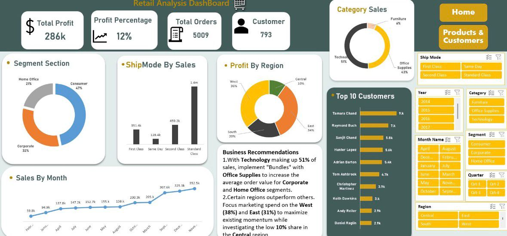
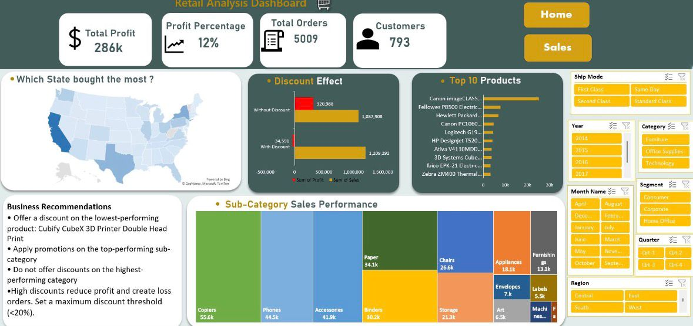

# 📊 Retail Sales Analysis Dashboard

## 📝 Project Overview
This project is an advanced retail data analysis dashboard built upon a robust **Star Schema** data model. By connecting multiple Dimension tables (Customers, Products, Locations, Dates, Categories, etc.) to a central Sales Fact table, this dashboard provides deep, multi-dimensional insights into over $2.29 million of retail sales. The goal of this project is to track overall financial health and uncover strategic areas for profit optimization.

## 📂 Data Architecture (Star Schema)
The dataset is structured using a relational data model to ensure data integrity and analytical flexibility:
* **Fact Table:** `FactOrder` (Contains transactional data: Sales, Quantity, Profit, and foreign keys).
* **Dimension Tables:** `DimCustomer`, `DimProduct`, `DimLocation`, `DimDate`, `DimCategory`, `DimSubCategory`, `DimDiscount`, `DimShipmod`, and `DimSegmant`.

## 💡 Key Findings & Financial Insights
Based on the analysis of the transactional data:
* **Overall Financials:** The retail store generated **$2,297,200** in total sales, yielding a net profit of **$286,397**.
* **The "Discount" Problem:** The data revealed a critical profitability issue regarding the discount strategy:
  * Sales **without** discounts generated $1,087,908 in revenue and a very healthy profit of **$320,987**.
  * Sales **with** discounts generated slightly more revenue ($1,209,292), but resulted in a net **loss of -$34,590**. 
* **Category Performance:** Technology and Office Supplies heavily drive both sales volume and core profitability.

## 🚀 Strategic Recommendations
1. **Revamp Discount Strategy:** Immediately audit the current discount and promotional tiers. The data clearly shows that while discounts drive volume, they are actively cannibalizing total profits and resulting in overall losses for those transactions.
2. **Focus on High-Margin Segments:** Shift marketing focus toward customers who typically purchase at full price (e.g., specific corporate segments or high-value categories).
3. **Optimize Inventory:** Double down on inventory for top-performing sub-categories (like Copiers and Phones) that yield the highest un-discounted margins.

## 📸 Dashboard Previews

*(Note: The following images showcase the final Excel dashboard visualizations)*

### 1. Executive Retail Summary
*An overview of top-line revenue, profit margins, and key performance indicators.*

### 2. Category & Customer Segment Analysis
*A deeper dive into product performance and profitability across different variables.*

